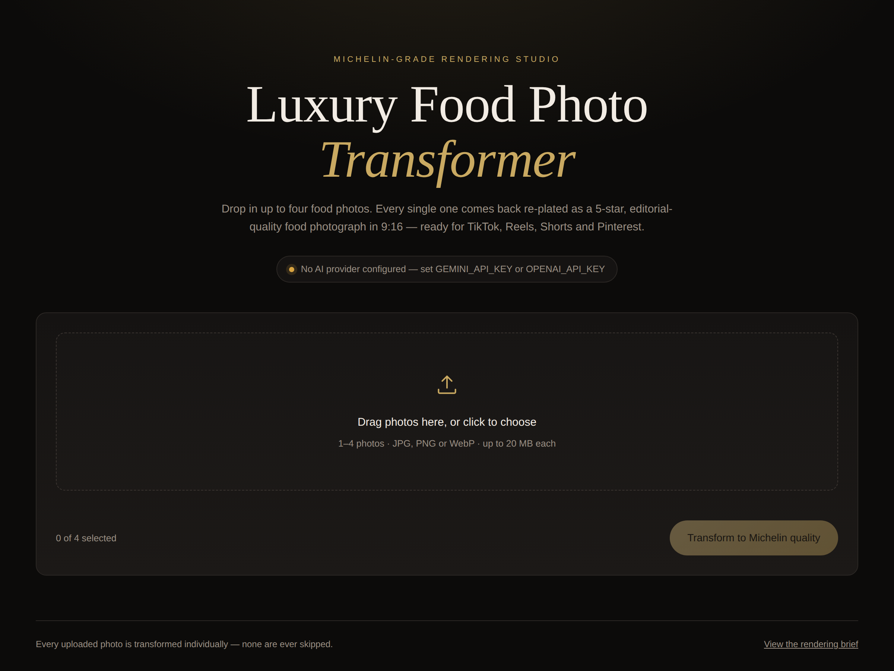

# 🍽️ Luxury Food Photo Transformer

Upload 1&ndash;4 food photos. Every one of them comes back as an ultra high-end,
5-star Michelin restaurant-quality food photograph in 9:16 portrait, ready for
TikTok, Reels, Shorts and Pinterest.



## The rules, and where they live in the code

The spec's critical rules are enforced by the app itself, not left to the model:

| Rule | Enforced by |
| --- | --- |
| Always generate an output image for every uploaded photo | `backend/jobs.py` &mdash; one independent task per photo, retried up to `MAX_ATTEMPTS`, then a local fallback render rather than nothing |
| 2, 3 or 4 photos are all transformed individually | `backend/jobs.py` &mdash; each photo is its own thread; one failure cannot cost you the others |
| Never skip an image | `providers/local_fallback.py` &mdash; the last-resort render, covered by `tests/test_rules.py` |
| Never ask for confirmation, never return text-only | `backend/app.py` &mdash; `POST /api/transform` starts the batch immediately; a text-only model reply raises and is retried |
| Preserve the dish, ingredients, portion and identity | `backend/prompt.py` &mdash; the `PRESERVE` section |
| 9:16, full-bleed, whole dish in frame | `backend/imaging.py` &mdash; every render leaves as exactly 1080&times;1920 |
| The engagement suggestion after every generation | `backend/prompt.py` &mdash; `ENGAGEMENT_TIP`, attached to every finished job |

## Quick start

```bash
cd luxury-food-transformer
python3 -m venv .venv && source .venv/bin/activate
pip install -r backend/requirements.txt

cp .env.example .env        # then add one API key
python backend/app.py
```

Open <http://127.0.0.1:5001>.

### API keys

You need exactly one:

- **Gemini** (recommended) &mdash; [aistudio.google.com/apikey](https://aistudio.google.com/apikey).
  Renders 9:16 natively, so nothing is cropped.
- **OpenAI** &mdash; [platform.openai.com/api-keys](https://platform.openai.com/api-keys).
  Renders 2:3, which the app centre-crops to 9:16 (about 8% off each side).

Without a key the app still runs and still returns an image for every upload,
but those are locally graded crops of your originals, clearly labelled
*Fallback render* &mdash; not AI re-plating. Set a key for the real thing.

## How it works

```
photo ──► normalise (EXIF upright, ≤2048px, JPEG)
      ──► provider.transform(photo, Michelin brief)   ×3 attempts
      ──► to_portrait_9x16()  ──► exactly 1080×1920
```

Uploading returns a job immediately (`202`); the UI polls it and fills each
card in as its photo finishes, so the first plate appears without waiting for
the fourth.

## API

| Endpoint | Purpose |
| --- | --- |
| `POST /api/transform` | multipart `images` (1&ndash;4 files) &rarr; `202` with a job |
| `GET /api/jobs/<id>` | job status, per-photo state, result URLs, and `tip` when finished |
| `GET /api/jobs/<id>/result/<i>` | the transformed 1080&times;1920 JPEG (`?download=1` to save) |
| `GET /api/jobs/<id>/source/<i>` | the normalised original, for before/after |
| `GET /api/health` | active provider and the output contract |
| `GET /api/prompt` | the exact brief sent to the model |

```bash
curl -X POST http://127.0.0.1:5001/api/transform \
  -F images=@steak.jpg -F images=@pasta.jpg
```

## Adding a provider

Subclass `ImageProvider` in `backend/providers/`, implement `is_configured()`
and `transform(image_bytes, prompt) -> bytes`, and register it in
`providers/__init__.py`. The 9:16 guarantee and the retry/fallback behaviour
come for free.

## Tests

```bash
PYTHONPATH=backend:tests python -m unittest discover -s tests
```

24 tests, no API key needed &mdash; they run against a stubbed provider and cover
the batch rules, retries, the total-outage fallback and the 9:16 output for
every input shape.

## Configuration

Everything in `.env.example` is optional except a provider key. Notable knobs:
`MAX_ATTEMPTS`, `MAX_WORKERS`, `OUTPUT_WIDTH`/`OUTPUT_HEIGHT`, and
`ENABLE_LOCAL_FALLBACK=false` if you would rather a photo fail loudly than come
back as a locally graded crop.
